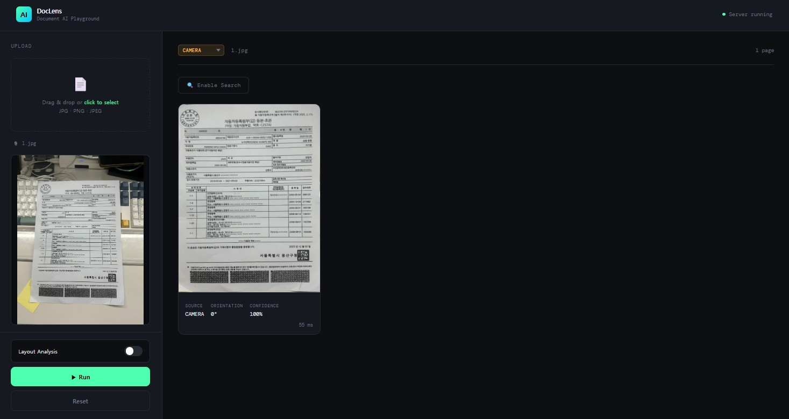
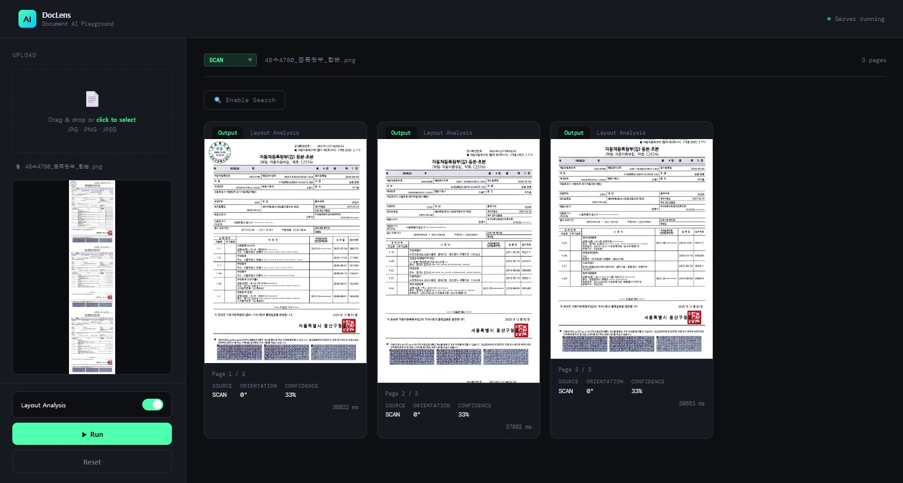
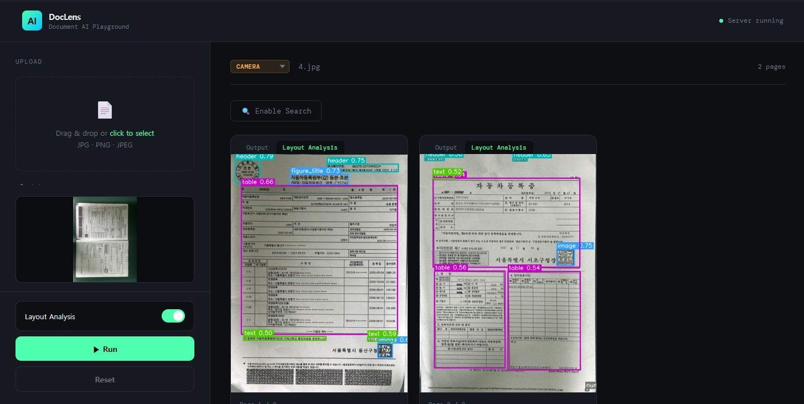
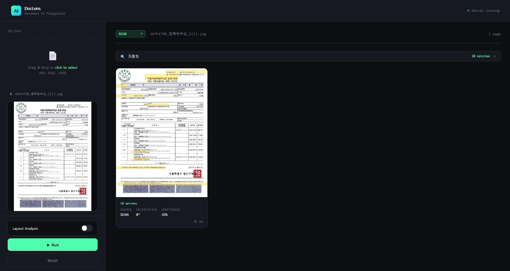

# DocLens — Document AI Playground (전처리 파이프라인)

자동차등록원부(갑) 이미지를 업로드하면 문서 소스 분류 → 기하 보정 → 방향 보정 → 합본분리 → 레이아웃 분석까지의 **전처리**를 자동화하고, 결과를 웹 인터페이스로 확인할 수 있는 AI-OCR 파이프라인 데모 서비스입니다.

> 본 repo는 AI-OCR 파이프라인 중 **전처리 단계**만 다룹니다. OCR 결과 후처리(LLM 기반 구조화·오류 교정)는 별도 사내 인프라에서 수행되며 이 repo에는 포함되어 있지 않습니다.

## 관련 문서

- [전처리 파이프라인 발표자료](docs/AI-OCR_전처리_파이프라인.pdf) — 소스 분류, 문서 영역 탐지, 방향/기울기 보정, 레이아웃 분석 방법론 및 실험 결과

---

## 전체 파일 구조

```
preprocess_final_npm/
│
├── pipeline.py          # 메인 파이프라인 오케스트레이터 + CLI
├── classify.py          # 문서 소스 분류기 (scan / camera / screenshot)
├── segment.py           # 문서 영역 탐지 및 원근 보정 (YOLOv8s-seg)
├── preprocess.py        # 전처리 유틸 (방향 보정, 합본분리, 기울기 보정)
├── layout.py            # 레이아웃 분석기 (PP-StructureV2)
│
├── server.py            # FastAPI 백엔드 서버
├── frontend/            # React + Vite 프론트엔드
│   ├── index.html
│   ├── vite.config.js
│   └── src/
│       ├── main.jsx
│       ├── App.jsx
│       ├── index.css
│       └── components/
│           ├── Header.jsx
│           ├── Sidebar.jsx
│           └── ResultCard.jsx
│
├── docs/                # 관련 발표자료·문서
│   └── images/          # README 데모 스크린샷
├── weights/             # YOLOv8s-seg 가중치 (git 미포함, 아래 참고)
└── results/             # 파이프라인 실행 결과물 (git 미포함, 실행 시 자동 생성)
```

> `weights/`, `results/`, `frontend/node_modules/`는 `.gitignore`로 제외되어 있습니다.
> 자세한 내용은 [Git 저장소 범위](#git-저장소-범위) 참고.

---

## 기술 스택

### 파이프라인

| 기술 | 용도 |
|------|------|
| YOLOv8s-seg (파인튜닝) | 문서 영역 탐지 및 원근 보정 (COCO 사전학습 → 커스텀 데이터 파인튜닝) |
| PaddleOCR `DocImgOrientationClassification` | 문서 방향 보정 (0/90/180/270도 분류) |
| PaddleOCR PP-OCRv5 (한국어) | 합본분리용 텍스트 인식 |
| PP-StructureV2 LayoutDetection | 레이아웃 분석 (table/text/header 등) |
| OpenCV | 이미지 처리 전반 (warp, deskew, 시각화) |

### 웹 서비스

| 기술 | 용도 |
|------|------|
| FastAPI | 백엔드 API 서버 |
| Uvicorn | ASGI 서버 |
| React 18 | 프론트엔드 UI |
| Vite | 프론트엔드 빌드 도구 |

### 개발 환경

| 항목 | 내용 |
|------|------|
| OS | Ubuntu 22.04 (WSL2) |
| GPU | NVIDIA RTX 5090 |
| CUDA | 13.1 |
| Python 환경 | conda `ai-ocr2` |

---

## 파이프라인 흐름

```
이미지 입력
    │
    ▼
ScanCameraClassifier (classify.py)
    │
    ├─── scan ────────────────────────────────────────┐
    │    ① Orientation 보정 (합본분리 전 선행)          │
    │    ② 합본분리 (OCR 헤더 탐지)                    │
    │    ③ 페이지별 Deskew                             │
    │                                                 │
    └─── camera / screenshot ───────────────────────  │
         ① YOLO-seg crop (segment.py)                 │
         ② Perspective warp (원근 보정)                │
         ③ 합본분리 (aspect ≥ 2.0 조건부)              │
         ④ Orientation 보정 (페이지별)                  │
                                                      │
    ← ← ← ← ← ← ← ← ← ← ← ← ← ← ← ← ← ← ← ← ← ─ ┘
    최종 출력 → [옵션] PP-StructureV2 레이아웃 분석
```

### scan 경로

| 순서 | 단계 | 설명 |
|------|------|------|
| 1 | Orientation 보정 | 합본분리 전 선행. 회전된 합본에서 OCR이 헤더를 올바르게 읽으려면 먼저 세워야 함 |
| 2 | 합본분리 | OCR로 "자동차등록원부(갑)" 헤더 y좌표 탐지 → 페이지 슬라이싱. aspect < 2.0이면 단일 페이지로 처리 |
| 3 | Deskew | Hough line → median 각도 → 0.5도 미만 스킵 → 역방향 회전. 페이지별 개별 적용 |

### camera / screenshot 경로

| 순서 | 단계 | 설명 |
|------|------|------|
| 1 | YOLO-seg crop | YOLOv8s-seg 파인튜닝 모델로 문서 영역 탐지. 면적/aspect/IoU 필터 적용 |
| 2 | Perspective warp | 마스크 → 4코너 추출 → getPerspectiveTransform. 실패 시 mask_crop fallback |
| 3 | 합본분리 | warp 결과 aspect ≥ 2.0일 때만 시도 |
| 4 | Orientation 보정 | 합본분리 후 페이지별로 각각 적용 |

---

## Git 저장소 범위

다음 항목은 `.gitignore`로 제외되어 있습니다.

| 항목 | 이유 |
|------|------|
| `frontend/node_modules/` | `package-lock.json`으로 재생성 가능 (`npm install`) |
| `results/` | 파이프라인 실행 시 자동 생성되는 결과물. 실제 문서 스캔본이 포함될 수 있어 커밋하지 않음 |
| `weights/*.pt` | 모델 가중치 바이너리. 아래 안내에 따라 별도 다운로드 |
| `__pycache__/`, `*.pyc` | 생성 파일 |

### 모델 가중치 받기

`weights/best.pt`(YOLOv8s-seg 파인튜닝, 약 23MB)는 repo에 포함되어 있지 않습니다.
[Releases](#) 페이지에서 다운로드 후 `weights/best.pt` 경로에 두고 실행하세요.

```bash
mkdir -p weights
# best.pt를 weights/ 아래에 위치
```

---

## 설치 및 실행

### 의존성 설치

```bash
conda activate ai-ocr2

# 핵심 패키지
pip install -r requirements.txt --break-system-packages

# PyTorch는 별도 설치 필요 (RTX 5090 sm_120 지원 — cu128 버전)
pip install torch torchvision \
  --index-url https://download.pytorch.org/whl/cu128 \
  --break-system-packages
```

> 완전한 재현이 필요하면 `requirements-freeze.txt` 사용:
> ```bash
> pip install -r requirements-freeze.txt --break-system-packages
> ```

### 실행

```bash
# 터미널 1 — FastAPI 백엔드
cd ~/ai-ocr/preprocess_final_npm
uvicorn server:app --host 0.0.0.0 --port 8000 --reload

# 터미널 2 — Vite 개발 서버
cd ~/ai-ocr/preprocess_final_npm/frontend
npm run dev
```

브라우저에서 `http://localhost:5173` 접속.

### 프로덕션 빌드

```bash
cd frontend
npm run build   # ../static/ 에 빌드 결과물 생성
```

빌드 후에는 Vite 없이 FastAPI 서버만 실행해도 `http://localhost:8000` 에서 접근 가능.

---

## 웹 서비스 기능

### 이미지 업로드
- 드래그 앤 드롭 또는 클릭해서 파일 선택 (JPG / PNG / JPEG)
- 업로드 즉시 사이드바에 미리보기 표시

### 파이프라인 실행 (Run)
- **Layout Analysis** 토글 ON → PP-StructureV2 레이아웃 분석 함께 실행
- 결과는 페이지별 카드로 표시
- 각 카드: `Output` / `Layout Analysis` 탭 전환 가능
- Layout Analysis 탭에서 bbox 클릭 → 해당 영역 crop 라이트박스


*카메라로 촬영한 문서를 업로드하면 소스(CAMERA)와 방향(0°)을 자동 판별해 결과를 반환한다.*

### 합본(다중 페이지) 분리
스캔 이미지에 여러 페이지가 이어져 있으면 자동으로 페이지 단위로 분리해 각각 처리한다.


*3개 페이지가 이어진 합본 스캔본을 업로드하면 페이지별로 분리되어 각각 결과가 표시된다.*

### Layout Analysis
Layout Analysis를 켜면 header/table/text/image/figure_title 등 영역별 bbox와 confidence가 함께 표시된다.


*페이지별로 header, table, text 등 레이아웃 영역이 라벨링되어 표시된다.*

### 소스 분류 수동 변경
- 결과 헤더의 드롭다운 (SCAN / CAMERA / SCREENSHOT) 변경 시 즉시 재실행
- 분류기가 오분류했을 때 수동 교정 용도

### Text Search (Enable Search)
- 결과 확인 후 **Enable Search** 클릭 → 전체 페이지 PaddleOCR 실행
- 검색창에 텍스트 입력 → 모든 페이지에서 동시 하이라이트
- X 버튼은 검색어만 초기화 (OCR 재실행 불필요)


*"자동차" 검색 시 문서 내 모든 매칭 텍스트(10 matches)가 노란색으로 하이라이트된다.*

---

## API 엔드포인트

### `POST /api/process`

파이프라인 실행.

**Query Parameters**

| 파라미터 | 타입 | 기본값 | 설명 |
|----------|------|--------|------|
| `layout_analysis` | bool | false | PP-StructureV2 레이아웃 분석 실행 여부 |
| `text_search` | bool | false | 텍스트 검색용 OCR 실행 여부 |
| `force_source` | string | "" | 소스 강제 지정 (`scan` / `camera` / `screenshot`) |

**Request**: `multipart/form-data` — `file` 필드에 이미지

**Response**

```json
{
  "filename": "example.jpg",
  "results": [
    {
      "source": "scan",
      "source_conf": 0.33,
      "orientation": 0,
      "orient_conf": 0.91,
      "final_b64": "...",
      "elapsed_ms": 2539.0,
      "layout_b64": "...",
      "layout_crops": [
        { "label": "table", "conf": 0.87, "box": [x1, y1, x2, y2], "crop_b64": "..." }
      ],
      "ocr_data": [
        { "text": "자동차등록번호", "box": [x1, y1, x2, y2], "conf": 0.99 }
      ]
    }
  ]
}
```

### `POST /api/search`

텍스트 검색용 OCR 단독 실행.

**Request**: `multipart/form-data` — `file` 필드에 이미지 (final_image base64 → Blob)

**Response**

```json
{
  "ocr_data": [
    { "text": "말소등록일", "box": [1136, 314, 1265, 350], "conf": 0.98 }
  ]
}
```

---

## 서버 로그 형식

```
────────────────────────────────────────────
[Classify   ]    173ms  → scan (33%)
[Orient     ]     19ms  → 0deg (0.91)
[SplitOCR   ]      0ms  → 1 pages
[Deskew     ]     89ms
[Layout     ]   2232ms  → 12 boxes
[Total      ]   2539ms
────────────────────────────────────────────
[SearchOCR  ]  27154ms  → 115 texts
```

---

## 코드 규칙

### 기본값 고정 항목

`--orient-conf-th`와 `--layout-conf`는 argparse, `__init__`, `save_results` 세 곳 모두 `0.0`으로 유지.

### numpy array 비교

```python
# ❌ 잘못된 방법
warped = det.get('warped') or det.get('mask_crop')

# ✅ 올바른 방법
warped = det.get('warped')
if warped is None:
    warped = det.get('mask_crop')
```

---

## 알려진 이슈

| 이슈 | 심각도 | 현황 |
|------|--------|------|
| camera → screenshot 오분류 | 중간 | `_is_screenshot()` 조건이 일부 camera 이미지도 감지. 수정 시도했으나 보류 |
| 합본분리 헤더 미감지 | 낮음 | OCR 오인식이 심한 경우 키워드 매칭 실패 → 단일 페이지로 처리 |
| RTX 5090 PaddleOCR GPU 미지원 | 낮음 | sm_120 아키텍처 미지원. PaddleOCR 전체 CPU 동작. 추후 PaddlePaddle 업데이트 시 교체 예정 |
| Text Search bbox 오프셋 | 낮음 | 일부 이미지에서 하이라이트 위치 오차 발생 |

---

## 의존성

| 패키지 | 용도 |
|--------|------|
| `paddleocr` | 방향 보정, 합본분리 OCR, 레이아웃 분석, 텍스트 검색 OCR |
| `ultralytics` | YOLOv8s-seg 추론 |
| `torch` (cu128) | PyTorch — RTX 5090 sm_120 지원 버전 |
| `opencv-python` | 이미지 처리 전반 |
| `numpy` | 행렬 연산 |
| `Pillow` | DPI 메타데이터 읽기 |
| `piexif` | EXIF 메타데이터 파싱 |
| `fastapi` | 백엔드 API 서버 |
| `uvicorn` | ASGI 서버 |
| `python-multipart` | 파일 업로드 처리 |
